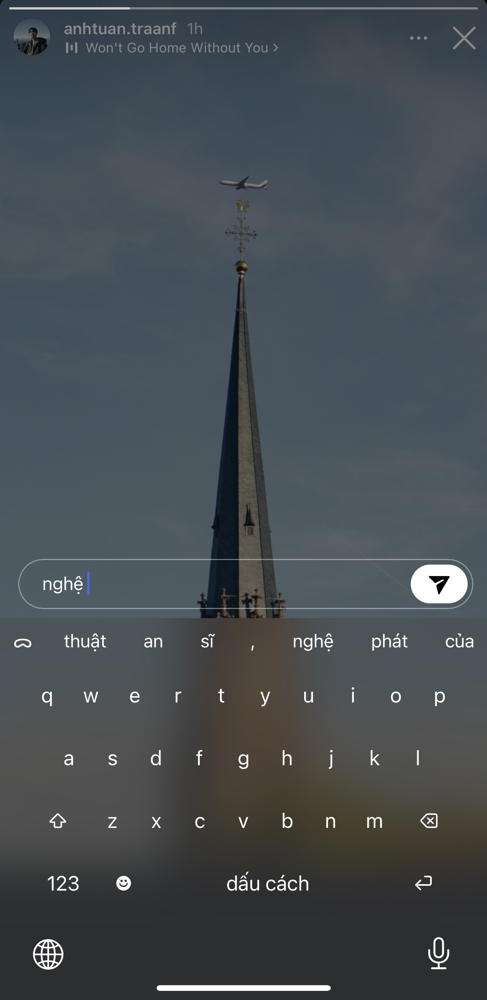

# ⎈︎ V7 Vietnamese Keyboard - The Future of Vietnamese Typing ⎈︎

<div align="center">

<table>
<tr>
<td width="45%" style="padding: 10px;">

<p><em>Artistic interface</em></p>
</td>
<td width="45%" style="padding: 10px;">

<p><em>Experience intelligent Vietnamese typing with context-aware predictions and intuitive radial tone selection</em></p>
</td>
</tr>
</table>
<!-- 
ffmpeg -i storeAssets/demo.artificial-intelligence.mp4 \
  -filter_complex "[0:v]setpts=PTS/1.4,fps=12,scale=640:-1:flags=lanczos" \
  -loop 0 storeAssets/demo.artificial-intelligence.gif 
  -->


> **Revolutionizing Vietnamese text input on iOS with cutting-edge AI technology**

[](https://swift.org)
[](https://developer.apple.com/ios/)
[](LICENSE)

</div>

## ✨ Overview

**V7 Vietnamese Keyboard** is not just another input method – it's a **revolutionary AI-powered Vietnamese typing experience** that transforms how Vietnamese speakers communicate on mobile devices. Built with state-of-the-art machine learning technology and designed for the modern user, V7 brings unprecedented intelligence and efficiency to Vietnamese text input.

## 🔥 Features & Technical Innovations

- **🧠 Custom GPT-2 Language Model** - 10M parameters optimized for Vietnamese with >70% top-1 prediction accuracy
- **📚 Advanced Tokenization** - 21,869 Vietnamese-specific tokens with greedy merge algorithm for optimal word boundaries
- **💾 Bias Vector Learning** - Personalization system that adapts to your vocabulary and writing style across sessions
- **⎈︎ Radial Menu Interface** - Revolutionary gesture-based tone mark selection
- **🎯 Smart Consonant Replacement** - Automatic conversion (j→ch, z→gi, f→ph) and Vietnamese phonetic pattern recognition
- **🎪 Context-Aware Punctuation** - Smart punctuation menu accessible via spacebar radial gesture
- **🌓 Adaptive Design** - Modern translucent UI that responds to iOS appearance modes
- **⚡ CoreML Optimized** - Native iOS inference with Neural Engine for near real-time response

**Tone Marks**: ◌́ (sắc) · ◌̀ (huyền) · ◌̉ (hỏi) · ◌̃ (ngã) · ◌̣ (nặng) · ◌ (không dấu)

## 📊 Technical Specifications

| Component | Details |
|-----------|---------|
| **Model** | GPT-2 (10M params) |
| **Vocabulary** | 21,869 Vietnamese tokens |
| **Context** | 32 tokens with intelligent truncation |
| **Accuracy** | >70% top-1, >90% top-5 |
| **Performance** | Real time prediction |

## 🛠️ Development

### Project Structure
```
v7-ios/
├── v7Keyboard/                      # Main app container
├── v7KeyboardExtension/             # Keyboard extension core
│   ├── KeyboardViewController.swift # Main UI controller
│   ├── V7GPTModel.swift            # CoreML model wrapper
│   ├── V7GPTTokenizer.swift        # Vietnamese tokenization
│   ├── BiasVectorManager.swift     # Personalization engine
│   ├── RadialMenu.swift            # Gesture-based tone input
│   ├── CacheManager.swift          # Prediction caching
│   └── Constants.swift             # Configuration
```

### Key Technologies
**Swift 5** · **CoreML** · **UIKit** · **Neural Engine** · **MLMultiArray**

## 📄 License

This project is licensed under the MIT License - see the [LICENSE](LICENSE) file for details.

## 🙏 Acknowledgments

- [karpathy/nanoGPT](https://github.com/karpathy/nanoGPT) - Base model architecture and training framework
- [EthanSK](https://github.com/EthanSK) - iOS keyboard extension foundation

---

<div align="center">

**-Revolutionize typing Vietnamese-**

</div>